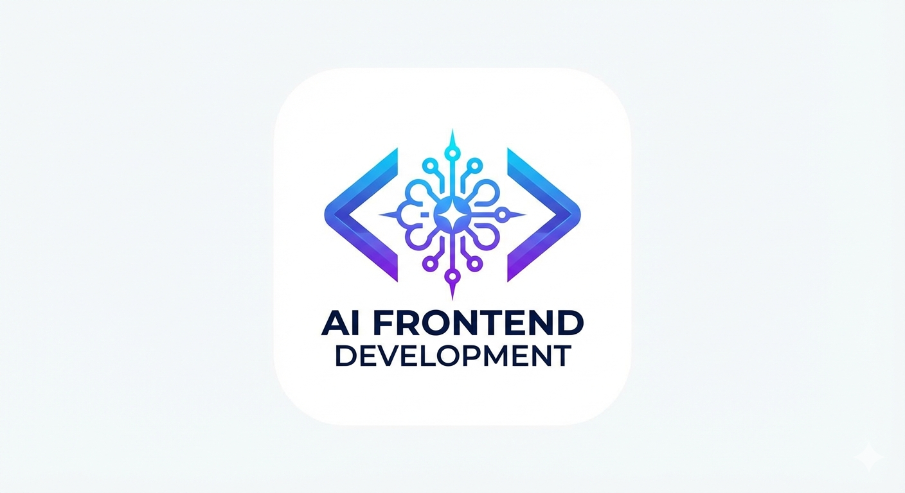

# ⚡ AI-Powered Frontend Architecture

   

## 📖 Project Overview

This frontend project demonstrates a next-generation development workflow using **AI-assisted tools** to rapidly design, generate, and refine a responsive user interface. 

By leveraging AI, we accelerated the creation of UI components, optimized the folder structure, and ensured clean, maintainable code. This project serves as a case study in maximizing developer productivity through the effective use of modern AI tooling.

### 🚀 Key Features
* **Rapid Prototyping:** Full UI scaffolding generated in minutes.
* **Responsive Design:** Mobile-first architecture ensured by AI layout analysis.
* **Clean Architecture:** Modular component structure following industry best practices.
* **Optimized Styling:** Tailwind CSS implementation for lightweight, fast-loading styles.

---

## 🤖 AI Toolchain & Workflow

We utilized a specific stack of AI tools to handle different stages of the development lifecycle.

| Tool | Category | Role in this Project |
| :--- | :--- | :--- |
| **Bolt.new** | Full-Stack Gen | **Project Foundation.** Used for the initial setup, folder structure creation, and core routing logic. |
| **v0.dev** | UI Generation | **Component Design.** Used to generate the Navbar, Product Cards, and intricate Tailwind CSS layouts. |
| **GitHub Copilot** | AI Pair Programmer | **Real-time Logic.** Assisted with autocomplete, function logic, and reducing syntax errors during coding. |
| **ChatGPT** | Assistant | **Refinement & Docs.** Used for debugging complex logic, code cleanup, and generating this documentation. |
| **Uizard / Galileo** | Design | **Visual Planning.** (Optional) Used to convert text concepts into visual UI references before coding. |

---

   
   git clone [https://github.com/your-username/your-repo-name.git](https://github.com/your-username/your-repo-name.git)

   ---

### 🧠 Part 3: Explanation of the Tools (For Interviews/Context)

Here is a breakdown of the tools you mentioned, explained simply so you can discuss them easily.

#### 1. Bolt.new (The Architect)
* **What it is:** A web-based development environment that can generate full-stack applications in the browser.
* **Why it's easy:** You don't need to install Node.js or configure Webpack manually. You just type "Create a React dashboard," and it builds the *entire* folder structure and runs it immediately.
* **Your use case:** You used this to "start" the car—getting the engine and wheels (project structure) running instantly.

#### 2. v0.dev by Vercel (The Designer)
* **What it is:** A generative UI system specifically for React and Tailwind CSS.
* **Why it's easy:** It understands modern design trends. Instead of writing 50 lines of CSS for a card, you type "A glass-morphism product card with a buy button," and it gives you the copy-paste code.
* **Your use case:** You used this for the "interior design"—the specific look and feel of the navbar and cards.

#### 3. ChatGPT (The Consultant)
* **What it is:** A Large Language Model (LLM) optimized for chat.
* **Why it's easy:** It acts as a senior developer sitting next to you. If your code breaks, you paste the error, and it finds the typo. It also writes the documentation (like the README above).
* **Your use case:** Quality control and documentation.

#### 4. GitHub Copilot (The Partner)
* **What it is:** An AI extension that lives inside your code editor (VS Code).
* **Why it's easy:** It predicts what you are going to type next. If you type `const calculateTotal =`, it will automatically suggest the math function to sum up the cart.
* **Your use case:** Speed. It saves you from typing repetitive syntax.

### 💡 Summary for your Interview
If asked about this project, say:
> *"I used an **AI-augmented workflow**. I used **Bolt.new** to scaffold the app instantly, **v0.dev** to generate pixel-perfect Tailwind components, and **GitHub Copilot** to handle the syntax heavy-lifting. This allowed me to focus purely on user experience and business logic rather than writing boilerplate code."*

**Would you like me to suggest some "Future Improvements" you could add to the README to make the project look even more ambitious?**
